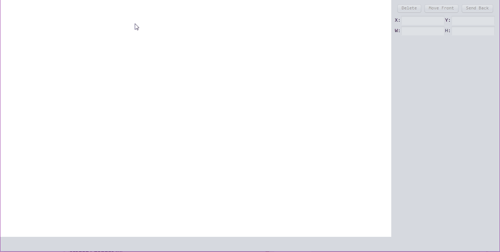

SketchUML
=========

*(Draw a process state chart with SketchUML, the title and menu bar is not recorded.)*

SketchUML is a pen-based interaction UML (Unified Modeling Language) diagram editor, 
which converts the shapes user drawn into software UML objects.

To use SketchUML, the user first imagine the shape of a figure and draw it on the software.
The software then recognizes the stroke and provides a list of objects the user likely means.
The user selects the object he/she truly means from the list. SketchUML convert the 
stroke into software object according to the selection, and the user could edit on the 
properties of the object.
